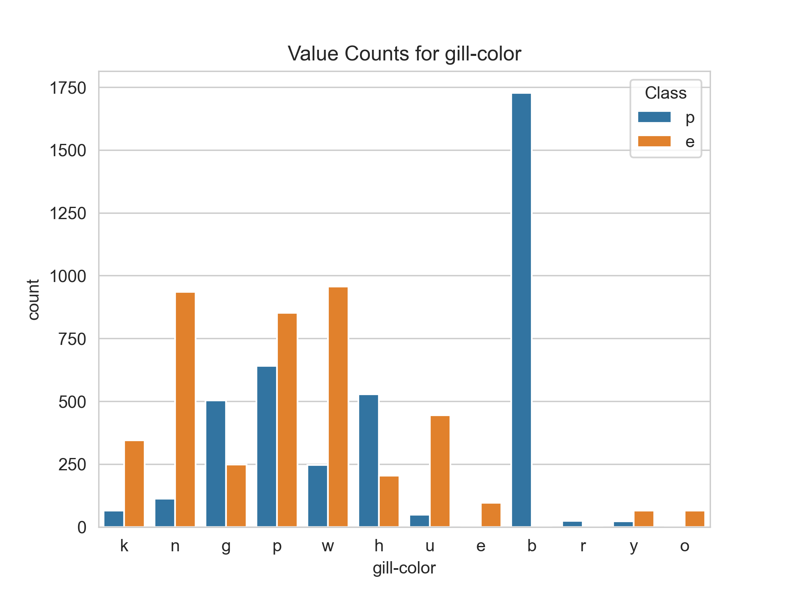
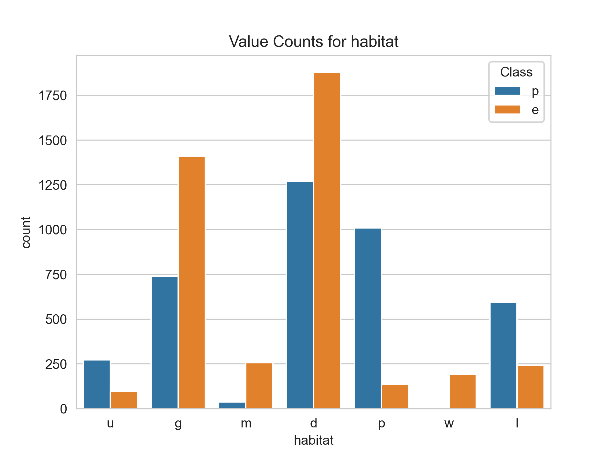

# Mushroom_Classification

**Problem Statement:**
The Audubon Society Field Guide to North American Mushrooms contains descriptions
of hypothetical samples corresponding to 23 species of gilled mushrooms in the Agaricus and Lepiota Family Mushroom (1981). Each species is labelled as either definitely edible, definitely poisonous, or maybe edible but not recommended. This last category was merged with the toxic category. The Guide asserts unequivocally that there is no simple rule for judging a mushroom's edibility, such as "leaflets three, leave it be" for Poisonous Oak and Ivy.

This project aims to develop a machine-learning algorithm to accurately classify mushrooms as either 'edible' or 'poisonous' based on their specifications like cap shape, cap-surface, bruises, odor, cap color, gill color, etc. utilizing various classifiers and supervised learning techniques.

---

Attribute Information: (classes: edible=e, poisonous=p)

* cap-shape: bell=b,conical=c,convex=x,flat=f, knobbed=k,sunken=s
* cap-surface: fibrous=f,grooves=g,scaly=y,smooth=s
* cap-color: brown=n,buff=b,cinnamon=c,gray=g,green=r,pink=p,purple=u,red=e,white=w,yellow=y
* bruises: bruises=t,no=f
* odor: almond=a,anise=l,creosote=c,fishy=y,foul=f,musty=m,none=n,pungent=p,spicy=s
* gill-attachment: attached=a,descending=d,free=f,notched=n
* gill-spacing: close=c,crowded=w,distant=d
* gill-size: broad=b,narrow=n
* gill-color: black=k,brown=n,buff=b,chocolate=h,gray=g, green=r,orange=o,pink=p,purple=u,red=e,white=w,yellow=y
* stalk-shape: enlarging=e,tapering=t
* stalk-root: bulbous=b,club=c,cup=u,equal=e,rhizomorphs=z,rooted=r,missing=?
* stalk-surface-above-ring: fibrous=f,scaly=y,silky=k,smooth=s
* stalk-surface-below-ring: fibrous=f,scaly=y,silky=k,smooth=s
* stalk-color-above-ring: brown=n,buff=b,cinnamon=c,gray=g,orange=o,pink=p,red=e,white=w,yellow=y
* stalk-color-below-ring: brown=n,buff=b,cinnamon=c,gray=g,orange=o,pink=p,red=e,white=w,yellow=y
* veil-type: partial=p,universal=u
* veil-color: brown=n,orange=o,white=w,yellow=y
* ring-number: none=n,one=o,two=t
* ring-type: cobwebby=c,evanescent=e,flaring=f,large=l,none=n,pendant=p,sheathing=s,zone=z
* spore-print-color: black=k,brown=n,buff=b,chocolate=h,green=r,orange=o,purple=u,white=w,yellow=y
* population: abundant=a,clustered=c,numerous=n,scattered=s,several=v,solitary=y
* habitat: grasses=g,leaves=l,meadows=m,paths=p,urban=u,waste=w,woods=d
* The dataset has 8,124 rows and 23 features included target.
* Dataset has only categorical data.
* The target variable determines whether a mushroom is classified as "edible" or "poisonous" based on its toxicity.

## Architecture Flow

## EDA

* In the given dataset, the 'Veil Type' feature has only one category and is not included as it does not contribute to the classification task, likely because all mushrooms in the dataset have the same 'Veil Type.'
* The 'stalk-root' feature in the dataset contains '?' symbols, which are replaced with 'None,' and any missing values are filled with the mode of the feature.

##### Visualization

Corelation

## Model_Training

**80% of the dataset was used for training the machine learning algorithm, and the remaining 20% was used for testing and evaluating its performance.**

#### I have used the following classification methods:

* **Logistic Regression Classifier**

* **Random Forest Classifier**

* **Gradient Boosting Classifier**

* **Support Vector Machine**

  
* **XGB Classifier**

* **Accuracy and Auc-Roc Score of Models**

**Our tuned classification models all performed really well with the dataset.But Among the five models (Logistic Regression, Random Forest, Support Vector Machine, GradientBoosting Classifier, and XGB Classifier), the Random Forest model was identified as the best-performing model for the given task.**

## WEB Application

Using Flask for the user interface, the web-based application accepts all mushroom features as input and provides a quick assessment of whether the mushroom is poisonous or edible.

* Home Page

* **Input Page(Test1)**
  
* **Output1**

* **Input Page(Test2)**

* **Output2**

## Tools Used

The tools used to build the model include Python with libraries like NumPy, Pandas, Matplotlib, Seaborn, Scikit-learn, and Flask was utilized as the web framework.

